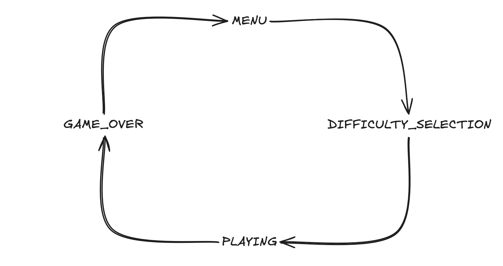

# MCC22107 - Flappy Bird

This is the repository for the Microcontrollers II discipline, at IFSC, final project.

It consists of a Flappy Bird game, implemented on the STM32 microcontroller, using:

- STM32F411CE (Black Pill) microcontroller
- TFT LCD Breakout 1.8'' (128x160) SPI
- Joystick (XY, Button)
- Buzzer
- ST-Link V2 for programming and debugging

The game follows this state machine, simplified:

    

The requirements for the projects are stated in this [PDF](./resources/Projeto_uC_II_2026_01.pdf).
The initial template with the project skeleton and peripherals configuration provided by the teacher is stored in this [zip file](./resources/Game_Start2_STM32F411CE.zip).
The code for the project is stored on [src](./src/).

## Gameplay

The game starts in the MENU state. To start it, the player must press the joystick button.

Then, the player can select the difficulty level on the SELECT_DIFFICULTY state, moving up and down with the joystick, and pressing the button to confirm the selection, with the following options:

- Low speed (Devagar)
- Medium speed (Regular)
- High speed (Turbo)

After selecting the difficulty level, the game starts in 3 seconds, with a countdown.
The bird starts at the center of the screen. The obstacles start to appear from the right side of the screen, and move towards the left side of the screen.

The player can move the bird up and down with the joystick.
For each obstacle passed, the player scores 1 point.

If the bird collides with any of the obstacles, the game is over and the player is shown the score on the GAME_OVER state screen.
The player can restart the game by pressing the joystick button, going to the MENU state.
